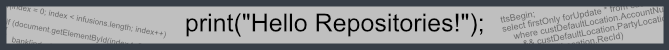
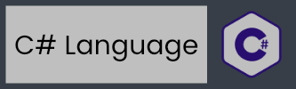
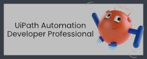
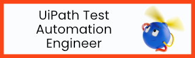
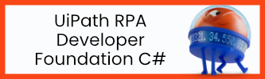
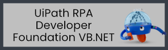
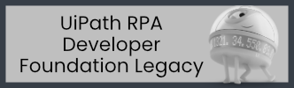
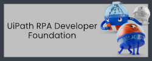

Hello, I love ☕coffee and 🌶️spicy food. There are many RPA training
supplements and projects in this repository in both C# and VB.NET.

 <h5>
   "Any fool can write code that a computer can understand. Good programmers write code that humans can understand." ― Martin Fowler
   
</h5>

 

> [!NOTE]
> 

> [!IMPORTANT]
> ✉️ [Contact me](https://bit.ly/m/shon) if you have a request, question, or
 comments.  Please reach out and lets connect!

> [!WARNING]
> **Code Lists**

# Image Testing 100x275

