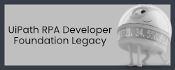

Hello, I love ☕coffee and 🌶️spicy food. There are many RPA training
supplements and projects in this repository in both C# and VB.NET.

 <h5>
   "Reading code is harder than writing it." ― Trisha Gee
   
</h5>

<h5>
  "Any fool can write code that a computer can understand. Good programmers write code that humans can understand." ― Martin Fowler
  
</h5>

> [!IMPORTANT]
> ✉️ [Contact me](https://bit.ly/m/shon) if you have a request, question, or
 comments.  Please reach out and lets connect!

### Links
- [Exercism](https://exercism.org/profiles/ShonHarsh) - Get **really** good at programming.
- [github-readme-stats](https://github.com/anuraghazra/github-readme-stats) - The repository that contains the visual stats widgets for this page.
- [LinkedIn](https://www.linkedin.com/in/shonharsh/)
- [Pulsar](https://pulsar-edit.dev/) (Atom Successor) - Used for all my README.md files
- [Shon Harsh Website](https://shonharsh.github.io/curriculum-vitae/index.html) -  127.0.0.1
- [This.GitHub](https://github.com/shonharsh) - F5
- [UiPath Automation Platform](https://www.uipath.com/) - Automation Devliverred
- [UiPath Studio](https://www.uipath.com/product/studio) - UiPath IDE
