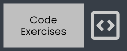
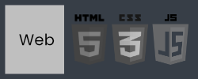
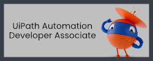
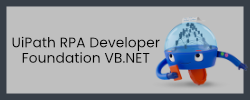

# Hello World!

## About Me

I am a developer that is passionate about building robots to automate software, API transactions, and anything else that sparks my curiosity. I also have a love for ☕ coffee and 🌶️ spicy food.

There are many RPA training supplements and projects in this repository in both C# and VB.NET.

> [!IMPORTANT]
> ✉️ [Contact me](https://bit.ly/m/shon) if you have a request, question, or
> comments. Please reach out and lets connect!

I have been reswizzeling all of these repositories. Some are a WIP and others still being published.

## Musings

"Any fool can write code that a computer can understand. Good programmers write code that humans can understand." ― Martin Fowler  
"Reading code is harder than writing it." ― Trisha Geev

## The Past Year's Journey

### Links

- [Exercism](https://exercism.org/profiles/ShonHarsh) - Get **really** good at programming.
- [github-readme-stats](https://github.com/anuraghazra/github-readme-stats) - The repository that contains the visual stats widgets for this page.
- [LinkedIn](https://www.linkedin.com/in/shonharsh/)
- [Shon Harsh Website](https://shonharsh.github.io/curriculum-vitae/index.html) - 127.0.0.1
- [This.GitHub](https://github.com/shonharsh) - F5
- [UiPath Automation Platform](https://www.uipath.com/) - Automation Delivered
- [UiPath Studio](https://www.uipath.com/product/studio) - UiPath IDE
- [Visual Studio Code](https://code.visualstudio.com/) - Learn it, use it, love it!
